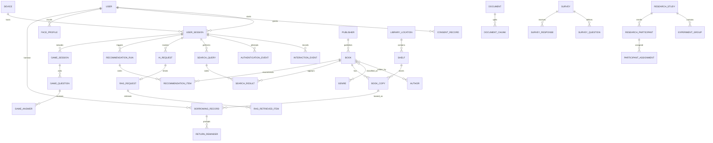

# Entity relationship diagram

```mermaid
erDiagram
  USER ||--o{ USER_SESSION : starts
  USER ||--o{ CONSENT_RECORD : grants
  USER ||--o{ FACE_PROFILE : enrolls
  DEVICE ||--o{ USER_SESSION : hosts
  USER_SESSION ||--o{ INTERACTION_EVENT : records
  USER_SESSION ||--o{ AUTHENTICATION_EVENT : attempts
  PUBLISHER ||--o{ BOOK : publishes
  BOOK }o--o{ AUTHOR : written_by
  BOOK }o--o{ GENRE : classified_as
  BOOK ||--o{ BOOK_COPY : has
  LIBRARY_LOCATION ||--o{ SHELF : contains
  SHELF ||--o{ BOOK_COPY : stores
  USER_SESSION ||--o{ SEARCH_QUERY : performs
  SEARCH_QUERY ||--o{ SEARCH_RESULT : ranks
  BOOK ||--o{ SEARCH_RESULT : appears
  USER_SESSION ||--o{ AI_REQUEST : invokes
  AI_REQUEST ||--o| RAG_REQUEST : drives
  RAG_REQUEST ||--o{ RAG_RETRIEVED_ITEM : retrieves
  DOCUMENT ||--o{ DOCUMENT_CHUNK : splits
  USER_SESSION ||--o{ RECOMMENDATION_RUN : triggers
  RECOMMENDATION_RUN ||--o{ RECOMMENDATION_ITEM : ranks
  BOOK ||--o{ RECOMMENDATION_ITEM : recommends
  USER_SESSION ||--o{ GAME_SESSION : includes
  GAME_SESSION ||--o{ GAME_QUESTION : asks
  GAME_QUESTION ||--o{ GAME_ANSWER : receives
  USER ||--o{ BORROWING_RECORD : borrows
  BOOK_COPY ||--o{ BORROWING_RECORD : loaned_as
  BORROWING_RECORD ||--o{ RETURN_REMINDER : prompts
  SURVEY ||--o{ SURVEY_QUESTION : defines
  SURVEY ||--o{ SURVEY_RESPONSE : receives
  RESEARCH_STUDY ||--o{ EXPERIMENT_GROUP : contains
  RESEARCH_STUDY ||--o{ RESEARCH_PARTICIPANT : enrolls
  RESEARCH_PARTICIPANT ||--o{ PARTICIPANT_ASSIGNMENT : assigned
```
