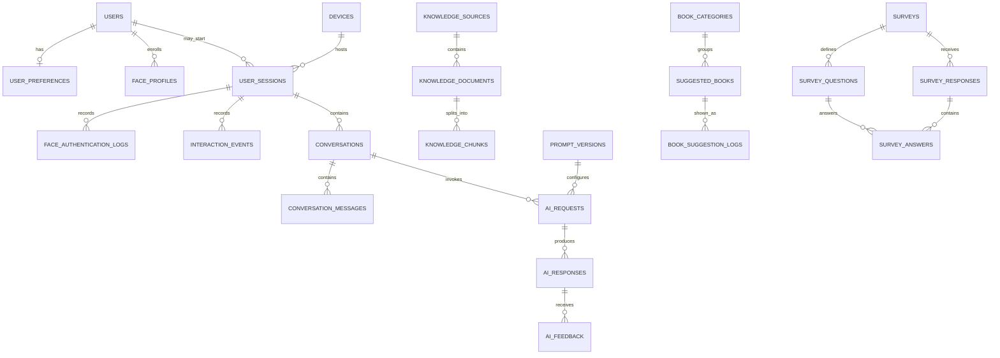

# ERD — AI Kiosk Assistant

```mermaid
erDiagram
  USERS ||--o| USER_PREFERENCES : has
  USERS ||--o{ FACE_PROFILES : enrolls
  USERS ||--o{ USER_SESSIONS : may_start
  DEVICES ||--o{ USER_SESSIONS : hosts
  USER_SESSIONS ||--o{ FACE_AUTHENTICATION_LOGS : records
  USER_SESSIONS ||--o{ INTERACTION_EVENTS : records
  KNOWLEDGE_SOURCES ||--o{ KNOWLEDGE_DOCUMENTS : contains
  KNOWLEDGE_DOCUMENTS ||--o{ KNOWLEDGE_CHUNKS : splits_into
  USER_SESSIONS ||--o{ CONVERSATIONS : contains
  CONVERSATIONS ||--o{ CONVERSATION_MESSAGES : contains
  CONVERSATIONS ||--o{ AI_REQUESTS : invokes
  PROMPT_VERSIONS ||--o{ AI_REQUESTS : configures
  AI_REQUESTS ||--o{ AI_RESPONSES : produces
  AI_RESPONSES ||--o{ AI_FEEDBACK : receives
  BOOK_CATEGORIES ||--o{ SUGGESTED_BOOKS : groups
  SUGGESTED_BOOKS ||--o{ BOOK_SUGGESTION_LOGS : shown_as
  SURVEYS ||--o{ SURVEY_QUESTIONS : defines
  SURVEYS ||--o{ SURVEY_RESPONSES : receives
  SURVEY_RESPONSES ||--o{ SURVEY_ANSWERS : contains
  SURVEY_QUESTIONS ||--o{ SURVEY_ANSWERS : answers
```

`daily_report_metrics` là aggregate độc lập theo ngày. Các liên kết tới user/session trong log thường nullable để giữ lịch sử ẩn danh và tránh cascade-delete facts.
