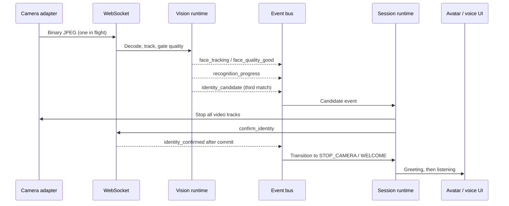

# Central event system

`frontend/src/runtime/eventBus.ts` owns subscriptions. The transport delivers backend envelopes into the bus. The sensor controller subscribes and dispatches guarded session actions; AssistantAvatar can subscribe directly or accept a controlled mood. Voice transcription and lifecycle are events, not status queries.

## Envelope

JSON messages use event, payload, monotonic per-connection sequence, and optional request_id. Binary messages are JPEG frames. Sequence numbers restart after reconnect and are diagnostic, not an event replay log. AI response envelopes are correlated by request_id. Subscribers must unsubscribe on unmount. Connection callbacks ignore superseded sockets.

## Events and commands

| Name | Producer | Meaning |
| --- | --- | --- |
| `CONFIGURE` | Client command | Set idle, recognition, registration or conversation sensor mode and `session_id` |
| `stream_ready` / `stream_disconnected` | Server / transport | Connection lifecycle |
| `frame_ready` | Server | Frame acknowledged; includes processing latency |
| `presence_detected` / `presence_lost` | Server or hardware adapter | Debounced presence / absence |
| `camera_ready` / `camera_stopped` | Camera adapter | Physical sensor lifecycle |
| `face_detected` | Server | Visible track identifiers |
| `face_tracking` | Server | Boxes, landmarks, Track IDs and quality data |
| `face_quality_good` / `face_quality_bad` | Server | Quality gate result and visitor guidance |
| `recognition_started` | Server | A gated matching attempt began |
| `recognition_progress` | Server | Track and provider confidence |
| `identity_candidate` | Server | Current vote progress; `confirmed: true` requests runtime acceptance |
| `confirm_identity` | Client command | Accept the pending proposal for the current session |
| `identity_confirmed` | Server | Identity transaction committed |
| `identity_unknown` | Server / runtime | Match miss or recognition deadline; scanning continues |
| `registration_requested` | UI | Visitor chose face registration |
| `voice_ready` | Voice runtime | Welcome completed and voice conversation is ready |
| `session_reset` | Session runtime | Return to a clean idle session |
| WELCOME_STARTED / WELCOME_FINISHED | Runtime | Welcome presentation lifecycle |
| AI_REQUEST | Client | Final text/voice transcript and conversation/session identifiers |
| AI_PROCESSING_STARTED / AI_PROCESSING_FINISHED | Server | Existing AI answer operation lifecycle and final answer |
| AI_LISTENING_STARTED / AI_LISTENING_STOPPED | Voice adapter, echoed by server | Microphone lifecycle |
| TRANSCRIPT_UPDATED | Voice adapter, echoed by server | Interim transcript for live UI |
| AI_SPEAKING_STARTED / AI_SPEAKING_FINISHED | Voice adapter, echoed by server | TTS lifecycle |
| SURVEY_STARTED / SURVEY_COMPLETED | Runtime, echoed by server | Survey lifecycle |
| SESSION_STATE | Server | Accepted sensor mode and session identifier |
| SESSION_STATE_CHANGED | Runtime | Local state machine transition |
| SESSION_TIMEOUT / SESSION_FINISHED / RETURN_IDLE | Runtime | Session lifecycle |
| PING / PONG / STREAM_LATENCY | Transport / server | Connection heartbeat and round-trip timing |
| STREAM_ERROR / REQUEST_ERROR | Server | Recoverable frame failure / failed AI request |

Local-only events are not promises of backend event persistence. Existing REST transactions remain responsible for session/survey storage. The stream is not a durable broker.
