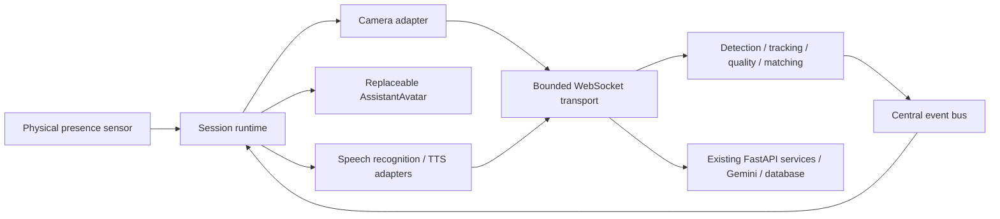

# Realtime receptionist runtime

Implemented 2026-09-05. This document supersedes the snapshot/countdown runtime documents.

## Boundaries

The kiosk is a continuously running assistant. React presents session state; the camera is a temporary sensor. The existing 24-table model, Gemini integration, AI answer transactions, enrollment endpoint, conversations, and surveys remain intact.

## Decisions

- A connection owns its tracker, candidate votes and sensor mode. There is no global identity cache shared between visitors. Tracks match by bounding-box intersection-over-union, with one-to-one assignments and expiry after one second without observation. Movement below 0.85 IoU restarts stability; a match below 0.45 starts a new track. This conservative tracker intentionally forgets identity after interruption.
- HOG detection and facial landmarks use the already selected local face-recognition stack. New frames are decoded in memory. Existing matching accepts a file path, so only eligible probes use an automatically deleted private temporary file. No live frame is added to permanent media storage.
- Recognition requires one face, a minimum 100-pixel face edge, mean grayscale brightness 45–215, Laplacian variance at least 65, eye geometry, frontal landmark ratios and 1.2 seconds of stable position. These are initial engineering thresholds, not clinically or statistically validated quality scores. Landmarks estimate eye visibility/head pose; they do not prove visibility through all occlusions.
- The same track must match the same identity three consecutive times. Matching is limited to one attempt per 650 ms. Quality failure, a different identity, disappearance or transport restart clears evidence. Multiple faces pause recognition, avoiding selection of a bystander.
- A candidate requires client acknowledgement before the identity transaction. Camera tracks stop before acknowledgement; the final event then moves through STOP_CAMERA and WELCOME. No camera component is mounted during voice conversation.
- Unknown-user options appear after 20 seconds. Recognition stays alive behind those options. Eight seconds of face absence returns an active scan to idle. Silence in a conversation expires the session after the configured inactivity period.
- Enrollment keeps the existing form and business endpoint. After identity fields, a quality-approved streaming frame is submitted automatically. The frame must be fresh (at most two seconds old). There is no manual shutter.
- Backend inference and synchronous transactions run in worker threads, keeping FastAPI's event loop available. Client pacing and acknowledgement bound normal traffic to one frame in flight; deployments also need transport limits for untrusted clients.

## Presence is a physical constraint

A camera whose MediaStream is stopped cannot see a person. Production wake-up therefore requires the Electron presence-sensor bridge. After 1.2 seconds of uninterrupted presence the runtime wakes and creates the camera stream. Without that bridge the camera remains off; developer mode can simulate presence explicitly. Do not enable the external-sensor flag until its driver is connected.

## Readiness limits

The software foundation is implemented and unit/stream tested. It is not certified for unattended installation. Liveness/anti-spoofing, calibrated recognition thresholds, real hardware soak tests, device authentication, biometric encryption and retention, a reliable Electron speech provider, Windows installation and watchdog testing remain deployment gates. Mock matching is disabled on the live stream. CPU/FPS targets must be measured on the actual kiosk.
