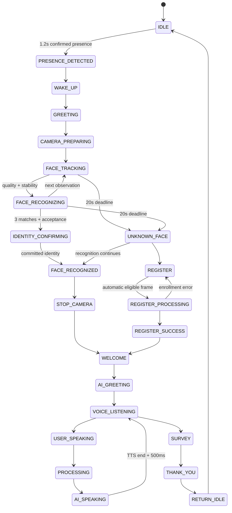

# Session state machine

The transition graph is implemented in frontend/src/runtime/stateMachine.ts. The existing reducer holds business data; async adapters deliver domain actions and epoch guards discard stale AI/enrollment results after reset. Direct TRANSITION actions are validated by the graph. Recognition success is accepted only from sensor states, and enrollment success only from REGISTER_PROCESSING.

UNKNOWN_FACE is the implementation name for the requested FACE_UNKNOWN branch. LISTENING is retained as a compatibility alias for VOICE_LISTENING. Recognition continues while UNKNOWN_FACE is visible. The only visitor action is Register Face; there is no retry or guest action.

Presence lost for eight seconds during an active scan returns to idle. Session inactivity defaults to 60 seconds and is configurable with VITE_KIOSK_IDLE_TIMEOUT_SECONDS. Speech content and touch refresh activity; mere microphone restart does not. Processing pauses inactivity expiry but transport/API deadlines bound requests. Conversation errors expose a recoverable error screen. Exit opens the existing survey; completion shows thank-you and ends the session.

The camera effect depends on sensor ownership, not per-frame recognition state. It never remounts on a tracking/recognizing transition. Media permission generations prevent late getUserMedia resolution from reopening the camera after shutdown. The voice screen stays mounted across conversational state transitions; speech generation guards prevent the StrictMode cleanup cycle from opening duplicate microphone sessions.
