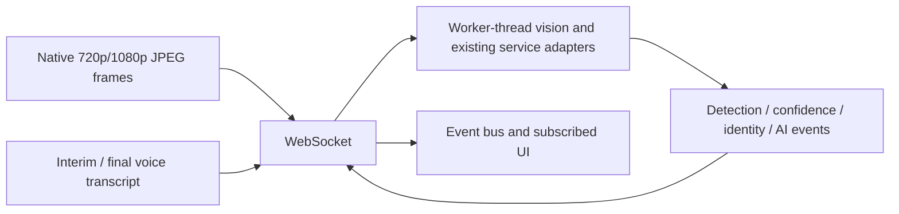

# Duplex streaming architecture

Endpoint: WS /api/v1/kiosk/stream (WSS when the API root uses HTTPS).

WebSocket was selected because both images and events travel in both directions. SSE is not implemented: it would require a separate upload channel and a second backpressure protocol. There is no REST recognition polling fallback.

## Flow control and recovery

- Active scanning attempts capture every 33 ms. Actual detection throughput is limited by server acknowledgements and kiosk hardware. The UI skips a frame while the previous one is pending or `bufferedAmount` exceeds 2.5 MB.
- Camera capture preserves the source dimensions: 1280×720 minimum requested, 1920×1080 preferred. The preview uses CSS `object-fit: contain`; its displayed size never changes recognition input. Server validation caps the JPEG at 2.5 MB and decoded dimensions at 1920×1080.
- `frame_ready` unlocks the next frame even after a decode/provider error. A missing acknowledgement closes the connection after 15 seconds. Reconnect backoff starts at 500 ms and caps at 10 seconds; current sensor configuration is restored and identity votes start over.
- Heartbeats run every 15 seconds. They measure transport health, not recognition completion. The server closes inactive connections after 90 seconds. Control JSON is limited to 32 KB. Configure Uvicorn with `--ws-max-size 2500000 --ws-max-queue 2` and restrict the listener to loopback for a standalone kiosk.
- AI requests have a 45-second client deadline. Interrupted requests fail rather than being replayed automatically. The server caches up to 32 completed request IDs per connection to reject duplicate execution. This is not durable idempotency across a reconnect or backend crash.
- A final voice transcript travels in AI_REQUEST. The stream adapter calls the existing browser-transcript persistence function and existing runtime_answer function. Gemini integration and its answer format remain unchanged. Responses arrive as one completed answer, not token-by-token audio or model token streaming.
- Browser STT and TTS remain the audio adapters. Raw microphone audio is not sent over this WebSocket. Interim transcript and voice-state events are streamed. Production Electron needs a tested speech provider or native adapter; browser Web Speech availability is not guaranteed there.
- Recognition is attempted at most every 500 ms for a stable quality-approved Track ID. The active gallery is loaded once per stream configuration. Detection uses a reduced analysis image, while embedding uses the original decoded frame and tracked native-coordinate box. Session creation, enrollment, survey submission and session end remain bounded one-shot REST transactions. These are commands, not polling. The API client enforces a 30-second request timeout.
- Developer telemetry separates decode, detection, tracking/quality, embedding and gallery-search time. `detection_fps` is measured at completed server observations; frontend capture FPS is reported separately.

## Trust boundary

KIOSK_STREAM_ORIGINS is an exact comma-separated allowlist. Defaults allow localhost:5173, 127.0.0.1:5173 and null for the packaged file renderer. Null origins are appropriate only for a loopback, locked-down kiosk backend. Origin checking is not authentication. Do not expose this endpoint on a public network until device authentication, authorization and deployment rate limits are in place. AI requests must reference a conversation belonging to the current active session. Raw templates and camera images never appear in event payloads.
