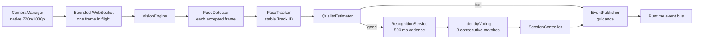

# Vision engine

The realtime vision pipeline is split into small connection-scoped services. None of these services owns React state or changes the database schema.

## Responsibilities

| Component | Location | Responsibility |
| --- | --- | --- |
| `CameraManager` | `frontend/src/runtime/CameraManager.ts` | Owns the physical `MediaStream`, asks for 1920×1080/30 fps with a 1280×720 minimum, captures native-resolution JPEG frames, attaches the same stream to the preview, and stops every track. |
| `PresenceDetector` | `backend/app/vision/presence_detector.py` | Debounces visible presence for 1.2 seconds. In production, idle wake-up should come from the Electron hardware bridge so the camera remains off. |
| `FaceDetector` | `backend/app/vision/face_detector.py` | Runs HOG detection on a 640 px analysis image, extracts landmarks, and maps both back to original-frame coordinates. |
| `FaceTracker` | `backend/app/vision/face_tracker.py` | Assigns Track IDs using IoU plus normalized centre/size association and expires after missed processed frames rather than slow wall-clock gaps. |
| `QualityEstimator` | `backend/app/vision/quality_estimator.py` | Suspends recognition for a small face, low light, strong backlight, blur, closed eyes, excessive head turn, multiple faces, or an unstable track. |
| `RecognitionService` | `backend/app/vision/recognition_service.py` | Enforces a 500 ms cadence, embeds the original frame at the tracked box, and reports embedding/search timings. |
| `IdentityVoting` | `backend/app/vision/identity_voting.py` | Requires three consecutive matches for the same identity. A miss, different candidate, quality failure, movement, disappearance, or reconnect clears the streak. |
| `SessionController` | `backend/app/vision/session_controller.py` | Owns stream mode, session binding, candidate lock, and confirmation acceptance. |
| `EventPublisher` | `backend/app/vision/event_publisher.py` | Emits the existing JSON envelope with a monotonic connection sequence and optional request ID. |
| `VisionEngine` | `backend/app/vision/engine.py` | Decodes a native frame once and coordinates detection, tracking, landmarks, and quality output. |

## Quality guidance

The estimator returns one Vietnamese instruction at a time: move closer, improve low light, reduce strong backlight, look at the camera, stand alone, or keep still. A bad observation emits `face_quality_bad` and clears votes instead of creating an authentication failure. A good observation emits `face_quality_good`; recognition can then run if its 500 ms cooldown has elapsed.

Thresholds are initial engineering defaults and need calibration on the actual camera, lighting, mounting height, and visitor population. Eye landmark ratios are a quality heuristic, not liveness or anti-spoofing.

## Performance contract

- The camera supplies native 720p or 1080p frames. CSS resizes only the visible `<video>`; recognition never reads the displayed dimensions.
- The client attempts capture on a 33 ms schedule while scanning, but sends only when `frame_ready` has acknowledged the previous frame. This prevents queue growth and WebSocket flooding.
- Detection runs on every accepted frame using an internal analysis image. Recognition runs on the original decoded frame at most every 500 ms for a stable, quality-approved track.
- The server accepts at most a 2.5 MB JPEG and decoded dimensions no larger than 1920×1080.
- `<300 ms` recognition latency is an acceptance target shown in developer diagnostics, not a guarantee independent of hardware or enrolled-profile count.
- `identity_candidate` with `confirmed: true` causes the renderer to freeze the last frame and stop all camera tracks before it sends `confirm_identity`.

No live frame is stored by this pipeline. Eligible frames remain in memory; recognition reuses the detected native-coordinate box and does not repeat HOG detection.
