# Vision engine investigation — 2026-09-05

## Executive finding

Realtime recognition failed through a chain of three independent defects. The tracker expired a face after one wall-clock second, while native 720p/1080p HOG work and the client/server acknowledgement loop could take longer than that. Every recreated track restarted the 0.8 second stability gate, so embedding frequently never ran. When it did run, the local matcher treated `1 - Euclidean distance` as probability and required 0.75, equivalent to an excessively strict dlib distance of 0.25. The frontend then rendered a missing score as 0%, making a suspended pipeline look like a completed zero-confidence match.

## Runtime pipeline verified

```mermaid
flowchart LR
  Camera[CameraManager<br/>native frame] --> WS[one-frame WebSocket]
  WS --> Decode[VisionEngine decode]
  Decode --> Detect[FaceDetector HOG + landmarks]
  Detect --> Track[FaceTracker association]
  Track --> Quality[QualityEstimator]
  Quality -->|accepted, 500 ms cadence| Embed[128D dlib embedding<br/>original image + tracked box]
  Embed --> Gallery[active FaceProfile gallery]
  Gallery --> Search[vectorized Euclidean nearest neighbour]
  Search --> Vote[3 consecutive identity votes]
  Vote --> Session[SessionController proposal]
  Session --> Events[EventPublisher envelope]
  Events --> Bus[frontend event bus]
  Bus --> UI[Kiosk state machine and UI]
```

Every stage is reachable. Before the correction, crop/embedding was implicit inside a second call to `face_recognition`: the eligible JPEG was written to a temporary file, decoded again, detected again, and then encoded. The current path encodes the original decoded frame with the already tracked native-coordinate box.

## Evidence and root causes

| Priority | Root cause | Evidence | Affected files | Correction |
| --- | --- | --- | --- | --- |
| P0 | Track lifetime used elapsed time instead of processed observations | `FaceTracker.update` deleted tracks at `now - seen >= 1.0`; quality required the same track for 0.8 s. This left 200 ms for capture, JPEG, WebSocket, decode, HOG, landmarks and response. | `backend/app/vision/face_tracker.py`, `quality_estimator.py` | Retain tracks for five missed processed frames, use IoU plus normalized centre/size association, and require three hits plus 350 ms stability. |
| P0 | Matching threshold used an uncalibrated score | Local confidence was `1 - distance` and success required 0.75, which means distance <= 0.25. Historical low-confidence results were 0.6014–0.7258 by that formula. | `backend/app/services/face_service.py`, `core/config.py` | Match on explicit Euclidean distance <= 0.60. Report a display score that maps distance 0.60 to 75%; document that it is not probability. |
| P0 | Recognition repeated the most expensive vision work | Eligible frames were written to disk, decoded, HOG-detected and landmarked a second time before encoding. Authentication logs averaged 2.54 s for successes and 2.49 s for low-confidence attempts. | `backend/app/api/v1/routes/runtime.py`, `vision/recognition_service.py` | Encode from the original in-memory frame with the known tracked box and cache the gallery for the configured recognition session. |
| P1 | Native-resolution HOG ran on every accepted frame | The detector received the full 1280×720 or 1920×1080 array. Backpressure made actual FPS equal server throughput, despite the client attempting 33 ms capture. | `backend/app/vision/face_detector.py`, `engine.py` | Detect on a 640 px analysis image and map boxes/landmarks back to native coordinates. Recognition still uses the original stream. |
| P1 | Frontend reported absent data as zero | `confidence[track_id] ?? 0` and `payload.confidence ?? 0` created a synthetic 0%. | `frontend/src/components/kiosk/TrackingDiagnostics.tsx` | Keep score absent until an attempt finishes; developer mode displays `--`. |
| P1 | Required lifecycle and stage telemetry was absent | No track-created/updated/lost or recognition-finished event existed. Frontend FPS counted sends; total frame latency did not isolate stages. | runtime route, event catalog, diagnostics | Emit lifecycle events and stage metrics without changing the WebSocket envelope. |
| P1 | Gallery separability needs field review | Five active profiles have valid finite 128D descriptors, but pairwise distances range 0.4175–0.6636. At least one pair is too close for reliable separation at a normal threshold. | enrolled `face_profiles` data | Re-enrol suspected duplicates with controlled pose/light and add multiple-template calibration in a later, schema-approved project. No schema change was made here. |

## Detector, tracker and quality findings

The original system did not record track lifetime, recreation rate, lost rate, bounding-box jitter, landmark jitter, or detector-only FPS. It therefore could not measure the requested behavior from historical data. Current developer telemetry reports processed FPS, stage latency, box IoU, track hits and age, cumulative creation/update/loss rates, face size, brightness, blur score, eye ratio, yaw ratio and roll ratio. Hardware acceptance must collect these metrics because no camera samples were retained.

Detector instability can still recreate a track when a box jumps beyond both the IoU and normalized-centre gates. Such a jump is now visible in `box_iou`, track lifecycle events and recreation rate. A brief missed detection preserves the ID but clears identity voting, preventing evidence from spanning a disappearance.

## Embedding and database findings

The configured provider is `local`. The database contains five active profiles, all five have JSON-serialized byte templates, all decode to exactly 128 finite values, and their L2 norms range from 1.3907 to 1.4424. No active profile relies on a mock reference. Dlib face descriptors are compared in their native space; applying probe-only normalization would corrupt compatibility comparison. Current telemetry verifies probe dimension, norm and best distance on every recognition attempt.

The search is a NumPy-backed `face_recognition.face_distance` batch over an in-memory list, which is Euclidean nearest-neighbour search. It is suitable for the current five-profile kiosk gallery. It is linear in enrolled profiles and is not appropriate for a very large gallery; that scale decision is outside this correction and would require an approved storage/search design.

## Events and frontend responsibility

The backend was responsible for Track ID churn, delayed embedding and threshold rejection. The frontend was responsible for the misleading zero display. The active preview already uses `object-fit: contain`, and the SVG uses the same meet behavior, so CSS does not crop recognition frames. `CameraManager` captures `videoWidth × videoHeight`; the preview dimensions do not enter recognition. Developer mode exposes Track ID, landmarks, FPS, latency, box/quality metrics, distance and score. Production mode renders the face rectangle and scan animation, then the recognized name or unknown message.

## Expected performance

With a typical kiosk CPU, reduced-resolution HOG should materially improve detector throughput, and removal of the second HOG pass should cut recognition latency. The state machine can make its first attempt after three observations and 350 ms stability; three 500 ms-spaced matching votes allow confirmation around 1.35 s plus processing time. The acceptance targets remain detector throughput approaching 30 FPS, recognition under 300 ms, and end-to-end confirmation in 0.5–1.5 s. These are hardware acceptance targets rather than guarantees from unit tests.

The closest enrolled-profile pair is the main residual accuracy risk. Run a labelled hardware evaluation before deployment and choose the operating distance threshold from false-accept and false-reject measurements rather than lowering it further from anecdotal trials.
